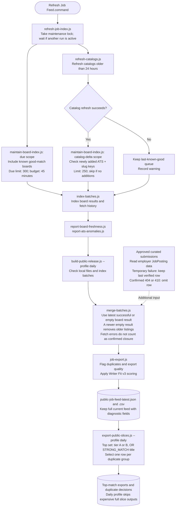
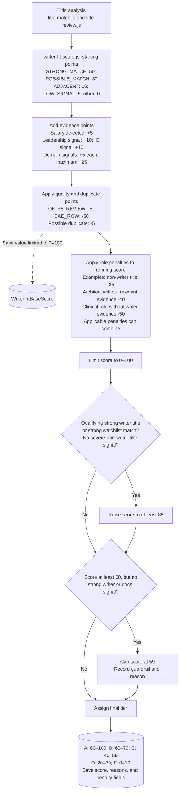
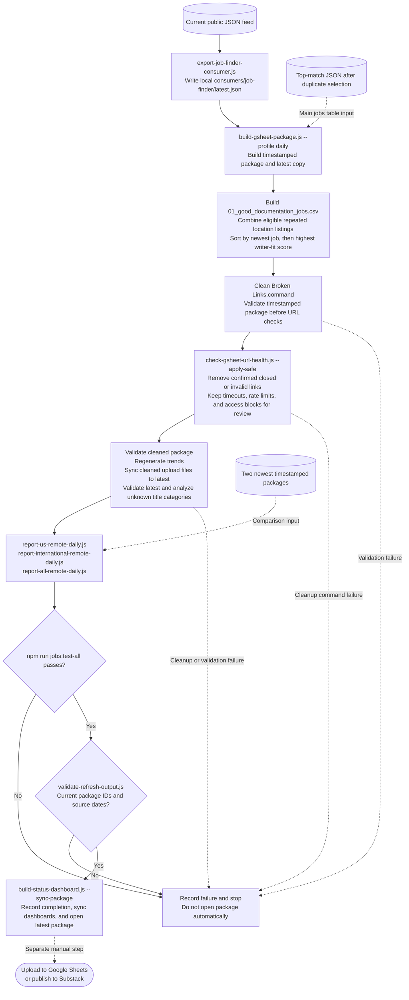

# Refresh Job Feed process

These diagrams summarize the current `Refresh Job Feed.command` process.
Script names refer to `src/scripts/` unless a different folder is shown.
The refresh prepares local files. Publication is a separate manual step.

## Source checks and feed build

Catalog checks and due-board checks start in parallel. The index step waits
for the required checks to finish. Invalid catalog data uses the previous
source; an unapproved row-count decline above 20% also triggers this fallback.
A required maintenance failure stops the refresh before the release build.

## Writer Fit v3 scoring

The score is a ranking aid. Location and remote status do not add score points.

The score floor applies after penalties. It is disabled for severe non-writer
title signals. The examples above are not the full penalty list; see
[writer-fit-score.js](../src/lib/writer-fit-score.js) for all conditions.

## Export, link checks, and validation

Duplicate selection uses [dedupe-select.js](../src/lib/dedupe-select.js).
It joins rows by duplicate-group or canonical-URL keys, with fallback keys
when those are absent. It selects the highest writer-fit score first. Ties
use tier, quality, US remote eligibility, work arrangement, salary evidence,
ATS priority, posting date, and stable text order. Remote fields can affect
this tie-break without changing the writer-fit score.

Link cleanup changes the Google Sheets package after the public feed and
Job Finder export are built. Those earlier exports do not receive this
package cleanup. The Job Finder export does not change Job Finder records.

The daily reports require explicit location evidence. A generic `Remote`
location is not enough. A multi-region job can appear in both source reports.
Reports contain current, added, removed, and continuing jobs.

The desktop entry starts the repository launcher. Run records preserve the
launcher path, hash, Git revision, arguments, and result. The package evidence
review is generated after link cleanup; user observations stay separate from
automated checks. Trend windows use recorded UTC package times, not folder
names. Coverage uses stable ATS + catalog slug board keys.

Solid arrows show the main process. Dotted arrows show additional data inputs,
failure paths, saved diagnostic values, or a separate manual step.

## Source files

- [Refresh launcher](../launchers/Refresh%20Job%20Feed.command)
- [Index maintenance script](../src/scripts/refresh-job-index.js) and [maintenance guide](job-index-maintenance.md)
- [Public release build](../src/scripts/build-public-release.js) and [batch merge](../src/scripts/merge-batches.js)
- [Job export fields](../src/lib/job-export.js) and [Writer Fit v3](../src/lib/writer-fit-score.js)
- [Slice exports](../src/scripts/export-public-slices.js) and [duplicate selection](../src/lib/dedupe-select.js)
- [Google Sheets package build](../src/scripts/build-gsheet-package.js)
- [Link cleanup launcher](../launchers/Clean%20Broken%20Links.command)
- [Curated submission checks](curated-submissions.md)

Update these diagrams when the refresh steps or scoring rules change.
